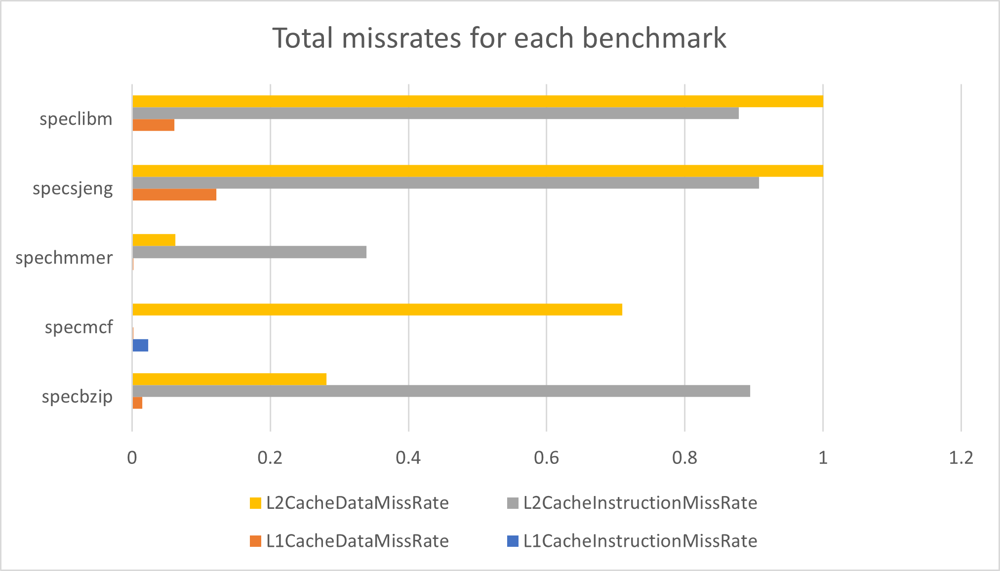

 

  <h1 align="center">Computer Architecture Assignment 2</h1>
  <h3 align="center">Aristotle University of Thessaloniki</h3>
  <h4 align="center">School of Electrical & Computer Engineering</h4>
  

    Contributors: Kyriafinis Vasilis, Nikolaos Giannopoulos
     
    Winter Semester 2021 - 2022
     
     
  

 

# 1. Simulation Parameters For The Subsystem Memory (Question 1)
The following benchmarks were run in order to produce the information needed:
    
    $ ./build/ARM/gem5.opt -d spec_results/specbzip configs/example/se.py --cpu-type=MinorCPU --caches --l2cache -c spec_cpu2006/401.bzip2/src/specbzip -o "spec_cpu2006/401.bzip2/data/input.program 10" -I 100000000 
    $ ./build/ARM/gem5.opt -d spec_results/specmcf configs/example/se.py --cpu-type=MinorCPU --caches --l2cache -c spec_cpu2006/429.mcf/src/specmcf -o "spec_cpu2006/429.mcf/data/inp.in" -I 100000000 
    $ ./build/ARM/gem5.opt -d spec_results/spechmmer configs/example/se.py --cpu-type=MinorCPU --caches --l2cache -c spec_cpu2006/456.hmmer/src/spechmmer -o "--fixed 0 --mean 325 --num 45000 --sd 200 --seed 0 spec_cpu2006/456.hmmer/data/bombesin.hmm" -I 100000000 
    $ ./build/ARM/gem5.opt -d spec_results/specsjeng configs/example/se.py --cpu-type=MinorCPU --caches --l2cache -c spec_cpu2006/458.sjeng/src/specsjeng -o "spec_cpu2006/458.sjeng/data/test.txt" -I 100000000 
    $ ./build/ARM/gem5.opt -d spec_results/speclibm configs/example/se.py --cpu-type=MinorCPU --caches --l2cache -c spec_cpu2006/470.lbm/src/speclibm -o "20 spec_cpu2006/470.lbm/data/lbm.in 0 1 spec_cpu2006/470.lbm/data/100_100_130_cf_a.of" -I 100000000 
     
 
 

## 1.1. The total number of committed instructions
The table below we shows the numbers of commited instructions along with the executed instructions. 

| BenchMarks | Committed Instructions | Executed Instructions | Memory Types | 
| :---: | :---: | :---: | :---: |
| Specbzip | 100000001 | 100190646 | DDR3_1600_8x8 |
| Specmcf | 100000000 | 100690949  | DDR3_1600_8x8 |
| Spechmmer | 100000000 | 100974536 | DDR3_1600_8x8 |
| Specsjeng | 100000000 | 100004279 | DDR3_1600_8x8 | 
| Speclibm | 100000000 | 100002680 | DDR3_1600_8x8 |

 

The number of commited instructions are found in this entry in the [stats.txt](https://github.com/Billkyriaf/computer_architecture_2/tree/main/spec_results) file: 

    system.cpu.committedInsts   NumberOFCommittedInstructions   # Number of instructions committed
      
 

The number of executed instructions is found int his entry in the [stats.txt](https://github.com/Billkyriaf/computer_architecture_2/tree/main/spec_results) file:
      
    system.cpu.discardedOps   NumberOFExecutedInstructions   # Number of ops (including micro ops) which were discarded before commit

    

 

> The executed instructions are allways more or at least equal to the commited instructions. This happens because the CPU simulated supports speculative execution. With speculative execution the CPU does not need to wait for the calculation of the branch instructions but as the name suggests it speculates on the result of the branch and continues execution based on this speculation. The predicted result will not allways be correct. In those cases the executed instructions are never commited to the registers and instead are discarded.

 

## 1.2 The total number of block replacements for the L1 data cache

The table with the block replacements for the L1 data cache:

| BenchMarks | Block replacements dcache |
| :---: | :---: |
| Specbzip | 710569 |
| Specmcf | 54452 |
| Spechmmer | 65718 |
| Specsjeng | 5262377 |
| Speclibm | 1486955 |

The L1 block replacements for the dcache can be found in the bellow line:  

    system.cpu.dcache.replacements number_of_replacements # number of replacements
      

 
 

## 1.3 Τhe number of accesses to the L2 cache

The table with the number of accesses to the L2 cache

| BenchMarks | Number of accesses | 
| :---: | :---: | 
| Specbzip | 712341 |
| Specmcf | 724390 | 
| Spechmmer | 70563 |
| Specsjeng | 5264051 |
| Speclibm | 1488538 |

The number of accesses are found here: 
 
    system.l2.overall_accesses::total  number_of_accesses   # number of overall (read+write) accesses
  

 

In case gem5 didn't give us this information about the number of accesses to the L2 cache we could say: 

    system.l2.overall_accesses::.cpu.inst             numberA                       # number of overall (read+write) accesses
    system.l2.overall_accesses::.cpu.data             numberB                       # number of overall (read+write) accesses
     
If we add the numbers numberA + numberB we will get the total number of accesses to the L2 cache (read+write). 

 
 

# 2. The results from the different benchmarks

## 2.1 Execution time

The time that the it takes the program to run on the emulated processor, not the time it takes the gem5 to perform the emulation

| BenchMarks | Execution time (s) | 
| :---: | :---: | 
| Specbzip | 0.083982 |
| Specmcf | 0.064955 | 
| Spechmmer | 0.059396 |
| Specsjeng | 0.513528 |
| Speclibm | 0.174671 |

These are found here: 

    sim_seconds  timeSeconds   # Number of seconds simulated

## 2.2 CPI

Cycles Per Instruction for each benchmark

| BenchMarks | CPI | 
| :---: | :---: | 
| Specbzip |  1.679650 |
| Specmcf | 1.299095 | 
| Spechmmer | 1.187917 |
| Specsjeng | 10.270554 |
| Speclibm | 3.493415 |

These are found here: 

       system.cpu.cpi  cpiValue   # CPI: cycles per instruction

## 2.3 Total missrates for each benchmark

Here we have the total missrates for the L1 Data cache, L1 Instruction cache and L2 cache.

  

I notice that in the 2 latest benchmark speclibm, specsjeng there are big miss L2 cache for both instances and data, this is probably due to the existence of for loops and branches that create problems when there is no provision for them. In the spechmmer benchmark we see that we have almost no L1 missrate and a small percentage of L2 cache miss.For the specmcf benchmark there is a lot of L2 data missrate and finally in the specbzip benchmark we see that we have a large L2 instructions missrate.

# 3. Simulation Parameters for  frequency 1.5GHz
Now we will do the same procedure with the benchmakrs but add `--cpu-clock=1.5GHz`  

     $ ./build/ARM/gem5.opt -d spec_results_newClock/specsjeng configs/example/se.py --cpu-type=MinorCPU --cpu-clock=1.5GHz --caches --l2cache -c spec_cpu2006/458.sjeng/src/specsjeng -o "spec_cpu2006/458.sjeng/data/test.txt" -I 100000000
     $ ./build/ARM/gem5.opt -d spec_results_newClock/speclibm configs/example/se.py --cpu-type=MinorCPU --cpu-clock=1.5GHz --caches --l2cache -c spec_cpu2006/470.lbm/src/speclibm -o "20 spec_cpu2006/470.lbm/data/lbm.in 0 1 spec_cpu2006/470.lbm/data/100_100_130_cf_a.of" -I 100000000 
 
  
     
| BenchMarks | Old system.clk_domain.clock | New system.clk_domain.clock | Old system.cpu_clk_domain.clock | New system.cpu_clk_domain.clock | 
| :---: | :---: | :---: |:---: |:---: |
| Specsjeng | 1000 | 1000  | 500 | 667 |
| Speclibm | 1000 | 1000  | 500 | 667 |

The "MinorCPU" model with the original frequency had system.clk_domain.clock at 1000 ticks/cycle and system.cpu_clk_domain.clock at 500 ticks/cycle after the change in both cases became as follows system.clk_domain. clock remained the same as the original (at 1000 ticks/cycle) but the change was seen in system.cpu_clk_domain.clock which became 667 ticks/cycle.By searching the config.json file we can see which systems are clocked at 1.5GHz which are as follows tol2bus, cpu(tags,itb,walker),dtb,dcache, l2.
     

This is so that the processor can work at maximum speed with the other subsystems with which it is speed-dependent. Adding another processor will dramatically increase the speed at which each instruction is executed but there must be a good understanding of how to write to memory as long as it is the same size as before and has the same bandwidth, the frequency is likely to remain the same.  

| BenchMarks | New Execution time (s) | 
| :---: | :---: | 
| Specsjeng | 0.581937  |
| Speclibm | 0.205034 |

 
There is no perfect scaling as from the two specific benchmarks from the above table you can see that with the new processor frequency there is a slight increase in execution time due to the fact that the bandwidth of the external memory remains the same and the transfer rate does not change  1.6 x 8 x 8 x 8 x 1/8 = 12.8GBps which means that writes and any data dependency on other parts of the program have to be delayed.
