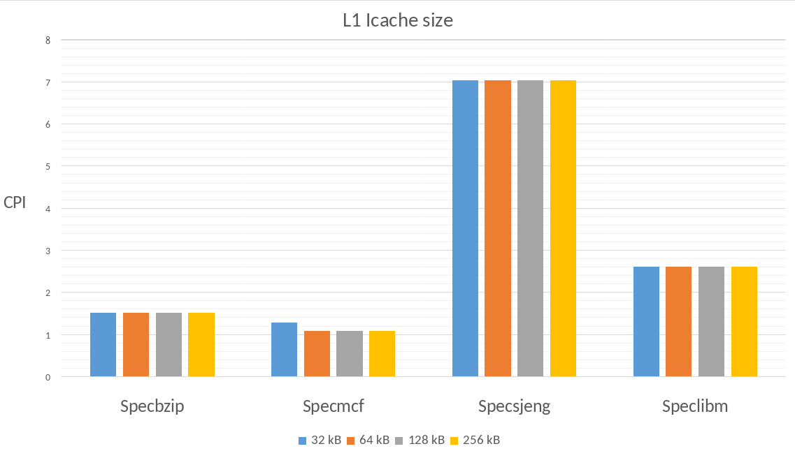
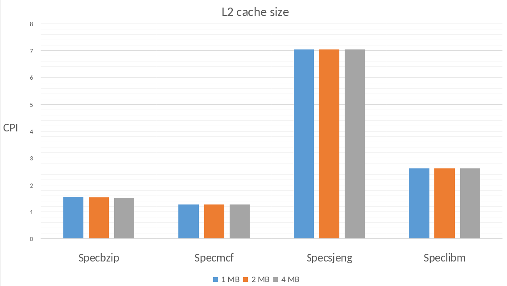
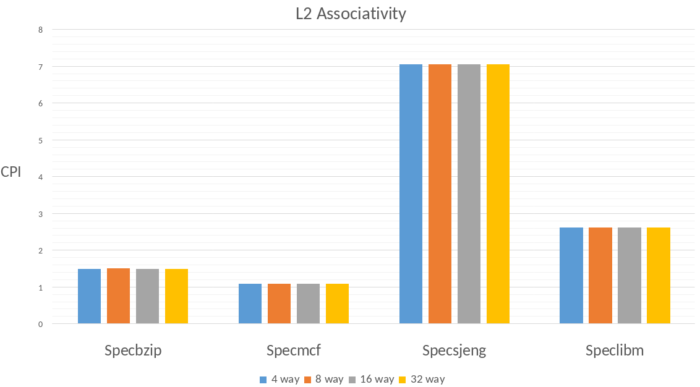
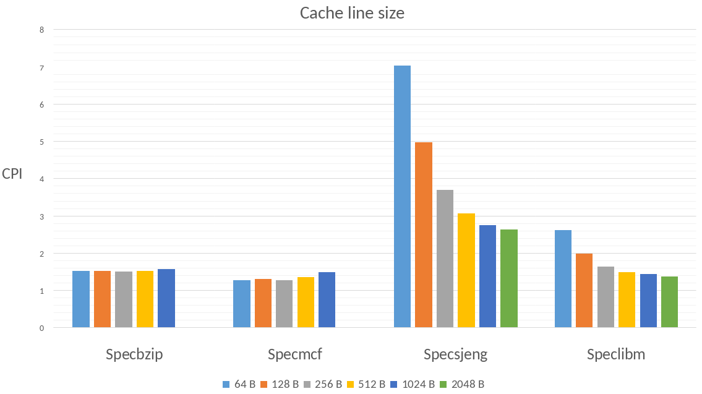

 

  <h1 align="center">Computer Architecture Assignment 2</h1>
  <h3 align="center">Aristotle University of Thessaloniki</h3>
  <h4 align="center">School of Electrical & Computer Engineering</h4>
  

    Contributors: Kyriafinis Vasilis, Nikolaos Giannopoulos
     
    Winter Semester 2021 - 2022
     
     
  

 

- [1. Step 1](#1-step-1)
  - [1.1. Simulation Parameters For The Subsystem Memory](#11-simulation-parameters-for-the-subsystem-memory)
    - [1.1.1. The total number of committed instructions](#111-the-total-number-of-committed-instructions)
    - [1.1.2. The total number of block replacements for the L1 data cache](#112-the-total-number-of-block-replacements-for-the-l1-data-cache)
    - [1.1.3. Τhe number of accesses to the L2 cache](#113-τhe-number-of-accesses-to-the-l2-cache)
  - [1.2. The results from the different benchmarks](#12-the-results-from-the-different-benchmarks)
    - [1.2.1. Execution time](#121-execution-time)
    - [1.2.2. CPI](#122-cpi)
    - [1.2.3. Total miss rates for each benchmark](#123-total-miss-rates-for-each-benchmark)
  - [1.3. Simulation Parameters for  frequency 1.5GHz](#13-simulation-parameters-for--frequency-15ghz)
- [2. Step 2](#2-step-2)
  - [2.1. Cache memory optimizations](#21-cache-memory-optimizations)
    - [2.1.1. Specbzip](#211-specbzip)
      - [2.1.1.1. L1 data cache size](#2111-l1-data-cache-size)
      - [2.1.1.2. L2 size](#2112-l2-size)
      - [2.1.1.3. Cache line size (Block size)](#2113-cache-line-size-block-size)
      - [2.1.1.4. L1 instruction cache size](#2114-l1-instruction-cache-size)
      - [2.1.1.5. L1 dcache associativity](#2115-l1-dcache-associativity)
      - [2.1.1.6. L2 associativity](#2116-l2-associativity)
      - [2.1.1.7. Final design](#2117-final-design)
    - [2.1.2. Specmcf](#212-specmcf)
      - [2.1.2.1. L1 data cache size](#2121-l1-data-cache-size)
      - [2.1.2.2. L2 size](#2122-l2-size)
      - [2.1.2.3. Cache line size (Block size)](#2123-cache-line-size-block-size)
      - [2.1.2.4. L1 instruction cache size](#2124-l1-instruction-cache-size)
      - [2.1.2.5. L1 icache associativity](#2125-l1-icache-associativity)
      - [2.1.2.6. L2 associativity](#2126-l2-associativity)
      - [2.1.2.7. Final design](#2127-final-design)
    - [2.1.3. Specsjeng](#213-specsjeng)
      - [2.1.3.1. L1 data cache size](#2131-l1-data-cache-size)
      - [2.1.3.2. L2 size](#2132-l2-size)
      - [2.1.3.3. Cache line size (Block size)](#2133-cache-line-size-block-size)
      - [2.1.3.4. L1 instruction cache size](#2134-l1-instruction-cache-size)
      - [2.1.3.5. L1 dcache associativity](#2135-l1-dcache-associativity)
      - [2.1.3.6. L2 associativity](#2136-l2-associativity)
      - [2.1.3.7. Final design](#2137-final-design)
    - [2.1.4. Speclibm](#214-speclibm)
      - [2.1.4.1. L1 data cache size](#2141-l1-data-cache-size)
      - [2.1.4.2. L2 size](#2142-l2-size)
      - [2.1.4.3. Cache line size (Block size)](#2143-cache-line-size-block-size)
      - [2.1.4.4. L1 instruction cache size](#2144-l1-instruction-cache-size)
      - [2.1.4.5. L1 dcache associativity](#2145-l1-dcache-associativity)
      - [2.1.4.6. L2 associativity](#2146-l2-associativity)
      - [2.1.4.7. Final design](#2147-final-design)
  - [2.2. Diagrams](#22-diagrams)
 - [3. Step 3](#3-step-3)

# 1. Step 1
## 1.1. Simulation Parameters For The Subsystem Memory
The following benchmarks were run in order to produce the information needed:
    
    $ ./build/ARM/gem5.opt -d spec_results/specbzip configs/example/se.py --cpu-type=MinorCPU --caches --l2cache -c spec_cpu2006/401.bzip2/src/specbzip -o "spec_cpu2006/401.bzip2/data/input.program 10" -I 100000000 
    $ ./build/ARM/gem5.opt -d spec_results/specmcf configs/example/se.py --cpu-type=MinorCPU --caches --l2cache -c spec_cpu2006/429.mcf/src/specmcf -o "spec_cpu2006/429.mcf/data/inp.in" -I 100000000 
    $ ./build/ARM/gem5.opt -d spec_results/spechmmer configs/example/se.py --cpu-type=MinorCPU --caches --l2cache -c spec_cpu2006/456.hmmer/src/spechmmer -o "--fixed 0 --mean 325 --num 45000 --sd 200 --seed 0 spec_cpu2006/456.hmmer/data/bombesin.hmm" -I 100000000 
    $ ./build/ARM/gem5.opt -d spec_results/specsjeng configs/example/se.py --cpu-type=MinorCPU --caches --l2cache -c spec_cpu2006/458.sjeng/src/specsjeng -o "spec_cpu2006/458.sjeng/data/test.txt" -I 100000000 
    $ ./build/ARM/gem5.opt -d spec_results/speclibm configs/example/se.py --cpu-type=MinorCPU --caches --l2cache -c spec_cpu2006/470.lbm/src/speclibm -o "20 spec_cpu2006/470.lbm/data/lbm.in 0 1 spec_cpu2006/470.lbm/data/100_100_130_cf_a.of" -I 100000000 
     
 
 

### 1.1.1. The total number of committed instructions
The table below we shows the numbers of committed instructions along with the executed instructions. 

| BenchMarks | Committed Instructions | Executed Instructions | Memory Types  |
| :--------: | :--------------------: | :-------------------: | :-----------: |
|  Specbzip  |       100000001        |       100190646       | DDR3_1600_8x8 |
|  Specmcf   |       100000000        |       100690949       | DDR3_1600_8x8 |
| Spechmmer  |       100000000        |       100974536       | DDR3_1600_8x8 |
| Specsjeng  |       100000000        |       100004279       | DDR3_1600_8x8 |
|  Speclibm  |       100000000        |       100002680       | DDR3_1600_8x8 |

 

The number of commited instructions are found in this entry in the [stats.txt](spec_results) file: 

    system.cpu.committedInsts   NumberOFCommittedInstructions   # Number of instructions committed
      
 

The number of executed instructions is found int his entry in the [stats.txt](spec_results) file:
      
    system.cpu.discardedOps   NumberOFExecutedInstructions   # Number of ops (including micro ops) which were discarded before commit

The executed instructions are allways more or at least equal to the commited instructions. This happens because the CPU simulated supports speculative execution. With speculative execution the CPU does not need to wait for the calculation of the branch instructions but as the name suggests it speculates on the result of the branch and continues execution based on this speculation. The predicted result will not allways be correct. In those cases the executed instructions are never commited to the registers and instead are discarded.

 

### 1.1.2. The total number of block replacements for the L1 data cache

The table with the block replacements for the L1 data cache:

| BenchMarks | Block replacements dcache |
| :--------: | :-----------------------: |
|  Specbzip  |          710569           |
|  Specmcf   |           54452           |
| Spechmmer  |           65718           |
| Specsjeng  |          5262377          |
|  Speclibm  |          1486955          |

The L1 block replacements for the dcache can be found in the bellow line:  

    system.cpu.dcache.replacements number_of_replacements # number of replacements
      

 
 

### 1.1.3. Τhe number of accesses to the L2 cache

The table with the number of accesses to the L2 cache

| BenchMarks | Number of accesses |
| :--------: | :----------------: |
|  Specbzip  |       712341       |
|  Specmcf   |       724390       |
| Spechmmer  |       70563        |
| Specsjeng  |      5264051       |
|  Speclibm  |      1488538       |

The number of accesses are found here: 
 
    system.l2.overall_accesses::total  number_of_accesses   # number of overall (read+write) accesses
  

 

In case gem5 didn't give us this information about the number of accesses to the L2 cache we could say: 

    system.l2.overall_accesses::.cpu.inst             numberA                       # number of overall (read+write) accesses
    system.l2.overall_accesses::.cpu.data             numberB                       # number of overall (read+write) accesses
     
If we add the numbers numberA + numberB we will get the total number of accesses to the L2 cache (read+write). 

 
 

## 1.2. The results from the different benchmarks

### 1.2.1. Execution time

The time that the it takes the program to run on the emulated processor, not the time it takes the gem5 to perform the emulation

| BenchMarks | Execution time (s) |
| :--------: | :----------------: |
|  Specbzip  |      0.083982      |
|  Specmcf   |      0.064955      |
| Spechmmer  |      0.059396      |
| Specsjeng  |      0.513528      |
|  Speclibm  |      0.174671      |

These are found here: 

    sim_seconds  timeSeconds   # Number of seconds simulated

### 1.2.2. CPI

Cycles Per Instruction for each benchmark

| BenchMarks |    CPI    |
| :--------: | :-------: |
|  Specbzip  | 1.679650  |
|  Specmcf   | 1.299095  |
| Spechmmer  | 1.187917  |
| Specsjeng  | 10.270554 |
|  Speclibm  | 3.493415  |

These are found here: 

       system.cpu.cpi  cpiValue   # CPI: cycles per instruction

### 1.2.3. Total miss rates for each benchmark

Here we have the total miss rates for the L1 Data cache, L1 Instruction cache and L2 cache.

  

I notice that in the 2 latest benchmark speclibm, specsjeng there are big miss L2 cache for both instances and data, this is probably due to the existence of for loops and branches that create problems when there is no provision for them. In the spechmmer benchmark we see that we have almost no L1 miss rate and a small percentage of L2 cache miss.For the specmcf benchmark there is a lot of L2 data miss rate and finally in the specbzip benchmark we see that we have a large L2 instructions miss rate.

## 1.3. Simulation Parameters for  frequency 1.5GHz
Now we will do the same procedure with the benchmakrs but add `--cpu-clock=1.5GHz`  

     $ ./build/ARM/gem5.opt -d spec_results_newClock/specsjeng configs/example/se.py --cpu-type=MinorCPU --cpu-clock=1.5GHz --caches --l2cache -c spec_cpu2006/458.sjeng/src/specsjeng -o "spec_cpu2006/458.sjeng/data/test.txt" -I 100000000
     $ ./build/ARM/gem5.opt -d spec_results_newClock/speclibm configs/example/se.py --cpu-type=MinorCPU --cpu-clock=1.5GHz --caches --l2cache -c spec_cpu2006/470.lbm/src/speclibm -o "20 spec_cpu2006/470.lbm/data/lbm.in 0 1 spec_cpu2006/470.lbm/data/100_100_130_cf_a.of" -I 100000000 
 
  
     
| BenchMarks | Old system.clk_domain.clock | New system.clk_domain.clock | Old system.cpu_clk_domain.clock | New system.cpu_clk_domain.clock |
| :--------: | :-------------------------: | :-------------------------: | :-----------------------------: | :-----------------------------: |
| Specsjeng  |            1000             |            1000             |               500               |               667               |
|  Speclibm  |            1000             |            1000             |               500               |               667               |

The "MinorCPU" model with the original frequency had system.clk_domain.clock at 1000 ticks/cycle and system.cpu_clk_domain.clock at 500 ticks/cycle after the change in both cases became as follows system.clk_domain. clock remained the same as the original (at 1000 ticks/cycle) but the change was seen in system.cpu_clk_domain.clock which became 667 ticks/cycle.By searching the config.json file we can see which systems are clocked at 1.5GHz which are as follows tol2bus, cpu(tags,itb,walker),dtb,dcache, l2.
     

This is so that the processor can work at maximum speed with the other subsystems with which it is speed-dependent. Adding another processor will dramatically increase the speed at which each instruction is executed but there must be a good understanding of how to write to memory as long as it is the same size as before and has the same bandwidth, the frequency is likely to remain the same.  

| BenchMarks | New Execution time (s) |
| :--------: | :--------------------: |
| Specsjeng  |        0.581937        |
|  Speclibm  |        0.205034        |

 
There is no perfect scaling as from the two specific benchmarks from the above table you can see that with the new processor frequency there is a slight increase in execution time due to the fact that the bandwidth of the external memory remains the same and the transfer rate does not change  1.6 x 8 x 8 x 8 x 1/8 = 12.8GBps which means that writes and any data dependency on other parts of the program have to be delayed.

# 2. Step 2
## 2.1. Cache memory optimizations

The information regarding the cache configuration for each benchmark can be found in the respective [`config.json`](spec_results) file. Initially all the simulations were run with the mentioned config files:

|      Cache      | Size  |   Associativity    | Block size |
| :-------------: | :---: | :----------------: | :--------: |
|     L1 Data     | 64 kB | 2 sets associative |  64 bytes  |
| L1 Instructions | 32 kB | 2 sets associative |  64 bytes  |
|  L2 (Unified)   | 2 MB  | 8 sets associative |  64 bytes  |

### 2.1.1. Specbzip

To find the best memory optimizations the above parameters were tested one at a time.

From the [`stats.txt`](spec_results/specbzip/stats.txt) file we can extract some useful information about the initial performance. 

|         |   CPI    | dcache overall Miss Rate | icache overall Miss Rate | L2 overall Miss Rate |
| :-----: | :------: | :----------------------: | :----------------------: | :------------------: |
| Initial | 1.673333 |         0.014248         |         0.000077         |       0.295244       |

The overall misses for the `L1 icache` are 751. Based on that the first test will be to increase only the `L1 dcache` with everything else remaining the same.

#### 2.1.1.1. L1 data cache size

| L1 dcache  size |   CPI    | dcache overall Miss Rate | icache overall Miss Rate | L2 overall Miss Rate |
| :-------------: | :------: | :----------------------: | :----------------------: | :------------------: |
|      16 kB      | 1.672106 |         0.021704         |         0.000078         |       0.187641       |
|      32 kB      | 1.638240 |         0.017837         |         0.000077         |       0.230498       |
|      64 kB      | 1.603996 |         0.014139         |         0.000077         |       0.295238       |
|     128 kB      | 1.576537 |         0.011140         |         0.000077         |       0.382576       |
|     256 kB      | 1.547263 |         0.008178         |         0.000077         |       0.540433       |

Increasing the size of the `L1 dcache` has no effect on `L1 icache miss rate` as expected. The `CPI` reduces as the size of the cache increases as the `L1 dcache miss rate` does too. The only disadvantage is that the `L2 miss rate` increases. This is the case because although the overall misses for L2 cache remained the same the total accesses were drastically reduced because L1 was bigger.

#### 2.1.1.2. L2 size

With everything keeping the same value and the L1 size being 256kB (the best result of the previous experiment) we start incrementing the size of the L2 cache.

| L2 cache size |   CPI    | dcache overall Miss Rate | icache overall Miss Rate | L2 overall Miss Rate |
| :-----------: | :------: | :----------------------: | :----------------------: | :------------------: |
|     1 MB      | 1.563444 |         0.008178         |         0.000077         |       0.608474       |
|     2 MB      | 1.547263 |         0.008178         |         0.000077         |       0.540433       |
|     4 MB      | 1.532711 |         0.008175         |         0.000077         |       0.483740       |

Increasing the size of the L2 cache improves the CPI further. Again as expected the `L2 miss rate` reduced because L2 can now hold more data than before.

#### 2.1.1.3. Cache line size (Block size)

From the previous tests it was determined that the best size for `L1` is `256kB` and for `L2` is `4 MB`. With that as a starting point the next thing to test is the effect the cache line size has to the simulated program.

| Cacheline size |   CPI    | dcache overall Miss Rate | icache overall Miss Rate | L2 overall Miss Rate |
| :------------: | :------: | :----------------------: | :----------------------: | :------------------: |
|    16 bytes    | 1.778735 |         0.018826         |         0.000096         |       0.710575       |
|    32 bytes    | 1.634486 |         0.012306         |         0.000087         |       0.612453       |
|    64 bytes    | 1.532711 |         0.008175         |         0.000077         |       0.483740       |
|   128 bytes    | 1.526626 |         0.006756         |         0.000067         |       0.347057       |
|   256 bytes    | 1.517955 |         0.006603         |         0.000064         |       0.231678       |
|   512 bytes    | 1.529753 |         0.007321         |         0.000057         |       0.154287       |
|   1024 bytes   | 1.576398 |         0.008637         |         0.000122         |       0.108546       |

Increasing the `cacheline` size brought an improvement on all the aspects that are monitored here. There is a limit to the size though and it is `256 bytes`. Above that value the locality of the program is hurt meaning there are data fetched from the memory with every block that are further apart and hence they are not useful at the current time. This fills the caches with unwanted data reducing performance.

#### 2.1.1.4. L1 instruction cache size

At this point the pattern is clean. Everything tested before this point is kept at the optimal value and the only the tested variable changes. 

| L1 icache  size |   CPI    | dcache overall Miss Rate | icache overall Miss Rate | L2 overall Miss Rate |
| :-------------: | :------: | :----------------------: | :----------------------: | :------------------: |
|      16 kB      | 1.518483 |         0.006603         |         0.000081         |       0.231680       |
|      32 kB      | 1.517955 |         0.006603         |         0.000064         |       0.231678       |
|      64 kB      | 1.518456 |         0.006603         |         0.000045         |       0.231669       |
|     128 kB      | 1.517251 |         0.006603         |         0.000040         |       0.231680       |
|     256 kB      | 1.517252 |         0.006603         |         0.000039         |       0.231679       |

As it was mentioned before this program has very few icache misses so increasing the `L1 icache` gave very little to none performance improvement.

#### 2.1.1.5. L1 dcache associativity

| L1 dcache  associativity |   CPI    | dcache overall Miss Rate | icache overall Miss Rate | L2 overall Miss Rate |
| :----------------------: | :------: | :----------------------: | :----------------------: | :------------------: |
|          2 way           | 1.517252 |         0.006603         |         0.000039         |       0.231679       |
|          4 way           | 1.517044 |         0.006323         |         0.000039         |       0.242710       |
|          8 way           | 1.517718 |         0.006250         |         0.000039         |       0.245758       |
|           full           | 1.509679 |         0.005320         |         0.000039         |       0.292270       |

Full set associative gives the best `CPI` for this simulation. Fully associative cache is generally great for performance but is very complex from the hardware perspective. Since this is `L1 cache` and is only `256kB` in size this is a relatively realistic scenario.

#### 2.1.1.6. L2 associativity

| L2 associativity |   CPI    | dcache overall Miss Rate | icache overall Miss Rate | L2 overall Miss Rate |
| :--------------: | :------: | :----------------------: | :----------------------: | :------------------: |
|      4 way       | 1.508460 |         0.005324         |         0.000039         |       0.292949       |
|      8 way       | 1.509679 |         0.005320         |         0.000039         |       0.292270       |
|      16 way      | 1.508105 |         0.005298         |         0.000039         |       0.287279       |
|      32 way      | 1.507638 |         0.005298         |         0.000039         |       0.287651       |

`L2` also benefits from associativity but as it is 16 time larger that L1 we can not realistically go to a fully associative design. The `32 way set associative` design seems like a good balance.

#### 2.1.1.7. Final design

| Design aspect | L1 dcache  size | L1 dcache  associativity | L1 icache  size | L1 icache  associativity | L2 cache size | L2 associativity | Cacheline size | Best CPI |
| :-----------: | :-------------: | :----------------------: | :-------------: | :----------------------: | :-----------: | :--------------: | :------------: | :------: |
|               |     256 kB      |    fully associative     |     256 kB      |          2 way           |     4 MB      |      32 way      |   256 bytes    | 1.507638 |

### 2.1.2. Specmcf

From the [`stats.txt`](spec_results/specmcf/stats.txt) file we can extract some useful information about the initial performance. 

|         |   CPI    | dcache overall Miss Rate | icache overall Miss Rate | L2 overall Miss Rate |
| :-----: | :------: | :----------------------: | :----------------------: | :------------------: |
| Initial | 1.298734 |         0.002079         |         0.023610         |       0.055082       |

#### 2.1.2.1. L1 data cache size

| L1 dcache  size |   CPI    | dcache overall Miss Rate | icache overall Miss Rate | L2 overall Miss Rate |
| :-------------: | :------: | :----------------------: | :----------------------: | :------------------: |
|      16 kB      | 1.326323 |         0.008184         |         0.023542         |       0.042767       |
|      32 kB      | 1.281189 |         0.002478         |         0.023624         |       0.054347       |
|      64 kB      | 1.278885 |         0.002079         |         0.023625         |       0.055082       |
|     128 kB      | 1.277895 |         0.001925         |         0.023625         |       0.055381       |
|     256 kB      | 1.277542 |         0.001844         |         0.023625         |       0.055540       |

Increasing the size of the `L1 dcache` has no effect on `L1 icache miss rate` as expected. The `CPI` reduces as the size of the cache increases as the `dcache miss rate` does too. The only disadvantage is that the `L2 miss rate` increases. This is the case because although the overall misses for `L2 cache` remained the same the total accesses were drastically reduced because `L1` was bigger.

#### 2.1.2.2. L2 size

With everything keeping the same value and the L1 size being 256kB (the best result of the previous experiment) we start incrementing the size of the L2 cache.

| L2 cache size |   CPI    | dcache overall Miss Rate | icache overall Miss Rate | L2 overall Miss Rate |
| :-----------: | :------: | :----------------------: | :----------------------: | :------------------: |
|     1 MB      | 1.280194 |         0.001844         |         0.023625         |       0.059948       |
|     2 MB      | 1.277542 |         0.001844         |         0.023625         |       0.055540       |
|     4 MB      | 1.277379 |         0.001844         |         0.023625         |       0.055127       |

Increasing the size of the `L2 cache` improves the `CPI` but not too much. Again as expected the `L2 miss rate` was reduced because `L2` can now hold more data than before. The affects of the size increase for the `L2 cache` are modest. This is because the limiting factor for this benchmark is the `L1 icache` where most of the misses happen.

#### 2.1.2.3. Cache line size (Block size)

From the previous tests it was determined that the best size for `L1` is `256kB` and for `L2` is `4 MB`. With that as a starting point the next thing to test is the effect the cache line size has to the simulated program.

| Cacheline size |   CPI    | dcache overall Miss Rate | icache overall Miss Rate | L2 overall Miss Rate |
| :------------: | :------: | :----------------------: | :----------------------: | :------------------: |
|    16 bytes    | 1.390975 |         0.004429         |         0.014546         |       0.210064       |
|    32 bytes    | 1.224059 |         0.002946         |         0.013170         |       0.160583       |
|    64 bytes    | 1.277308 |         0.001844         |         0.023625         |       0.055128       |
|   128 bytes    | 1.318068 |         0.001074         |         0.034839         |       0.020608       |
|   256 bytes    | 1.291262 |         0.000672         |         0.032593         |       0.011582       |
|   512 bytes    | 1.368126 |         0.000493         |         0.039855         |       0.004910       |
|   1024 bytes   | 1.493633 |         0.000469         |         0.038898         |       0.002582       |

Increasing the `cacheline` size brought an improvement on some of the aspects that are monitored here. The `L1 dcache miss rate` and `L2 miss rate`  seem to be positively affected by the increase. On the other hand `L1 icache` and the overall `CPI` are negatively affected. A good middle ground is `256 kB` because `CPI` and `L1 dcache miss rate` drop a little and the other two values are greatly favored.

#### 2.1.2.4. L1 instruction cache size

| L1 icache  size |   CPI    | dcache overall Miss Rate | icache overall Miss Rate | L2 overall Miss Rate |
| :-------------: | :------: | :----------------------: | :----------------------: | :------------------: |
|      16 kB      | 1.476380 |         0.000672         |         0.063960         |       0.006017       |
|      32 kB      | 1.291262 |         0.000672         |         0.032593         |       0.011582       |
|      64 kB      | 1.099167 |         0.000672         |         0.000027         |       0.513670       |
|     128 kB      | 1.099075 |         0.000672         |         0.000009         |       0.526280       |
|     256 kB      | 1.099075 |         0.000672         |         0.000009         |       0.526335       |

This test clearly shows the previous bottleneck on the `L1 icache`. This is a benchmark that runs multiple instructions on a relatively small amount of data. Increasing the size of `L1 icache` the `CPI` approached 1. The disadvantage here is the sudden increase in `L2 miss rate`. From 32kB to 64kB the `L1 icache misses` went from 847293 to just 709, meaning in that point most of the used instructions started to fit in the `L1 icache`. The sudden increase of the `L2 miss rate` is there because the total number of misses drastically lessened from 856085 initially to just 9499. 

#### 2.1.2.5. L1 icache associativity

| L1 icache  associativity |   CPI    | dcache overall Miss Rate | icache overall Miss Rate | L2 overall Miss Rate |
| :----------------------: | :------: | :----------------------: | :----------------------: | :------------------: |
|          2 way           | 1.099075 |         0.000672         |         0.000009         |       0.526335       |
|          4 way           | 1.099075 |         0.000672         |         0.000009         |       0.526335       |
|          8 way           | 1.099075 |         0.000672         |         0.000009         |       0.526335       |
|           full           | 1.099075 |         0.000672         |         0.000009         |       0.526335       |

Changing `L1 icache associativity` has no effect on the program. This is the case because above the `64kB` of `icache` the instruction misses are so few that there is a very small number of block replacements in the `L1 icache`. Obviously in a situation like that we would choose the 2 way associative since it is the most easy to manufacture among the rest of the options.

#### 2.1.2.6. L2 associativity

| L1 associativity |   CPI    | dcache overall Miss Rate | icache overall Miss Rate | L2 overall Miss Rate |
| :--------------: | :------: | :----------------------: | :----------------------: | :------------------: |
|      4 way       | 1.098808 |         0.000621         |         0.000009         |       0.569636       |
|      8 way       | 1.098808 |         0.000621         |         0.000009         |       0.569636       |
|      16 way      | 1.098808 |         0.000621         |         0.000009         |       0.569636       |
|      32 way      | 1.098808 |         0.000621         |         0.000009         |       0.569636       |

The same as the `L1 icache associativity` stands here too. There are very few misses for the `L2 cache` to benefit from a 16 or 32 set associative design. So the choice here is the "less" associative cache. 

#### 2.1.2.7. Final design

| Design aspect | L1 dcache  size | L1 dcache  associativity | L1 icache  size | L1 icache  associativity | L2 cache size | L2 associativity | Cacheline size | Best CPI |
| :-----------: | :-------------: | :----------------------: | :-------------: | :----------------------: | :-----------: | :--------------: | :------------: | :------: |
|               |     256 kB      |          2 way           |      64 kB      |          2 way           |     4 MB      |      4 way       |   256 bytes    | 1.098808 |

### 2.1.3. Specsjeng

From the [`stats.txt`](spec_results/specsjeng/stats.txt) file we can extract some useful information about the initial performance. 

|         |   CPI    | dcache overall Miss Rate | icache overall Miss Rate | L2 overall Miss Rate |
| :-----: | :------: | :----------------------: | :----------------------: | :------------------: |
| Initial | 7.054508 |         0.121831         |         0.000020         |       0.999972       |

#### 2.1.3.1. L1 data cache size

| L1 dcache  size |   CPI    | dcache overall Miss Rate | icache overall Miss Rate | L2 overall Miss Rate |
| :-------------: | :------: | :----------------------: | :----------------------: | :------------------: |
|      16 kB      | 7.057758 |         0.121835         |         0.000020         |       0.999910       |
|      32 kB      | 7.054582 |         0.121833         |         0.000020         |       0.999948       |
|      64 kB      | 7.054508 |         0.121831         |         0.000020         |       0.999972       |
|     128 kB      | 7.054581 |         0.121831         |         0.000020         |       0.999976       |
|     256 kB      | 7.054490 |         0.121830         |         0.000020         |       0.999983       |

Increasing the size of the `L1 dcache` reduces the `CPI` but does not affect anything else. 

#### 2.1.3.2. L2 size

With everything keeping the same value and the L1 size being 256kB (the best result of the previous experiment) we start incrementing the size of the L2 cache.

| L2 cache size |   CPI    | dcache overall Miss Rate | icache overall Miss Rate | L2 overall Miss Rate |
| :-----------: | :------: | :----------------------: | :----------------------: | :------------------: |
|     1 MB      | 7.055300 |         0.121831         |         0.000020         |       0.999972       |
|     2 MB      | 7.054508 |         0.121831         |         0.000020         |       0.999972       |
|     4 MB      | 7.052902 |         0.121831         |         0.000020         |       0.999972       |

Increasing the size of the `L2 cache` has also no effect on the miss rate for any of the parameters. The `CPI` reduces but in general it does not seem to have any other affect.

#### 2.1.3.3. Cache line size (Block size)

From the previous tests it was determined that the best size for `L1` is `256kB` and for `L2` is `4 MB`. With that as a starting point the next thing to test is the effect the cache line size has to the simulated program.

| Cacheline size |    CPI    | dcache overall Miss Rate | icache overall Miss Rate | L2 overall Miss Rate |
| :------------: | :-------: | :----------------------: | :----------------------: | :------------------: |
|     16 kB      | 21.927489 |         0.487302         |         0.000029         |       0.999994       |
|     32 kB      | 11.665813 |         0.243654         |         0.000022         |       0.999988       |
|     64 kB      | 7.054508  |         0.121831         |         0.000020         |       0.999972       |
|     128 kB     | 4.985905  |         0.060922         |         0.000015         |       0.999823       |
|     256 kB     | 3.715593  |         0.030472         |         0.000011         |       0.999167       |
|   512 bytes    | 3.071745  |         0.015279         |         0.000010         |       0.993572       |
|   1024 bytes   | 2.756658  |         0.007724         |         0.000010         |       0.972190       |
|   2048 bytes   | 2.653106  |         0.004024         |         0.000011         |       0.898117       |

Increasing the `cacheline` size substantially improved the `L1 dcache miss rate` as long as the `CPI`.  

#### 2.1.3.4. L1 instruction cache size

| L1 icache  size |   CPI    | dcache overall Miss Rate | icache overall Miss Rate | L2 overall Miss Rate |
| :-------------: | :------: | :----------------------: | :----------------------: | :------------------: |
|      16 kB      | 7.054504 |         0.121831         |         0.000022         |       0.999959       |
|      32 kB      | 7.054508 |         0.121831         |         0.000020         |       0.999972       |
|      64 kB      | 7.054504 |         0.121831         |         0.000019         |       0.999978       |
|     128 kB      | 7.054508 |         0.121831         |         0.000019         |       0.999979       |
|     256 kB      | 7.054508 |         0.121831         |         0.000019         |       0.999979       |

This benchmark is data intensive so `L1 icache size` does not have a significant impact on anything but the `L1 icache miss rate`. 

#### 2.1.3.5. L1 dcache associativity

| L1 dcache  associativity |   CPI    | dcache overall Miss Rate | icache overall Miss Rate | L2 overall Miss Rate |
| :----------------------: | :------: | :----------------------: | :----------------------: | :------------------: |
|          2 way           | 7.054508 |         0.121831         |         0.000020         |       0.999972       |
|          4 way           | 7.054520 |         0.121831         |         0.000020         |       0.999978       |
|          8 way           | 7.054565 |         0.121831         |         0.000020         |       0.999978       |
|           full           | 7.054495 |         0.121831         |         0.000020         |       0.999978       |

Changing `L1 dcache associativity` has no effect on the program. This means that there were very few collisions on the `L1 cache` to begin with.

#### 2.1.3.6. L2 associativity

| L1 associativity |   CPI    | dcache overall Miss Rate | icache overall Miss Rate | L2 overall Miss Rate |
| :--------------: | :------: | :----------------------: | :----------------------: | :------------------: |
|      4 way       | 7.054319 |         0.121831         |         0.000020         |       0.999972       |
|      8 way       | 7.054508 |         0.121831         |         0.000020         |       0.999972       |
|      16 way      | 7.054836 |         0.121831         |         0.000020         |       0.999972       |
|      32 way      | 7.053548 |         0.121831         |         0.000020         |       0.999972       |

The same as the `L1 icache associativity` stands here too.

#### 2.1.3.7. Final design

| Design aspect | L1 dcache  size | L1 dcache  associativity | L1 icache  size | L1 icache  associativity | L2 cache size | L2 associativity | Cacheline size | Best CPI |
| :-----------: | :-------------: | :----------------------: | :-------------: | :----------------------: | :-----------: | :--------------: | :------------: | :------: |
|               |     256 kB      |          2 way           |     256 kB      |          2 way           |     4 MB      |      4 way       |   2048 bytes   | 2.640992 |

### 2.1.4. Speclibm

From the [`stats.txt`](spec_results/speclibm/stats.txt) file we can extract some useful information about the initial performance. 

|         |   CPI    | dcache overall Miss Rate | icache overall Miss Rate | L2 overall Miss Rate |
| :-----: | :------: | :----------------------: | :----------------------: | :------------------: |
| Initial | 2.622539 |         0.060787         |         0.004073         |       0.997453       |

#### 2.1.4.1. L1 data cache size

| L1 dcache  size |   CPI    | dcache overall Miss Rate | icache overall Miss Rate | L2 overall Miss Rate |
| :-------------: | :------: | :----------------------: | :----------------------: | :------------------: |
|      16 kB      | 2.622464 |         0.060970         |         0.000093         |       0.999938       |
|      32 kB      | 2.622512 |         0.060971         |         0.000093         |       0.999942       |
|      64 kB      | 2.622539 |         0.060971         |         0.000093         |       0.999944       |
|     128 kB      | 2.622514 |         0.060971         |         0.000093         |       0.999944       |
|     256 kB      | 2.622555 |         0.060971         |         0.000093         |       0.999945       |

Increasing the size of the `L1 dcache` does not change the performance of the program. 

#### 2.1.4.2. L2 size

With everything keeping the same value and the L1 size being 256kB (the best result of the previous experiment) we start incrementing the size of the L2 cache.

| L2 cache size |   CPI    | dcache overall Miss Rate | icache overall Miss Rate | L2 overall Miss Rate |
| :-----------: | :------: | :----------------------: | :----------------------: | :------------------: |
|     1 MB      | 2.623668 |         0.060971         |         0.000093         |       0.999944       |
|     2 MB      | 2.622539 |         0.060971         |         0.000093         |       0.999944       |
|     4 MB      | 2.620140 |         0.060971         |         0.000093         |       0.999944       |

Increasing the size of the `L2 cache` has also no effect on the miss rate for any of the parameters. The `CPI` reduces but in general it does not seem to have any other affect.

#### 2.1.4.3. Cache line size (Block size)

From the previous tests it was determined that the best size for `L1` is `256kB` and for `L2` is `4 MB`. With that as a starting point the next thing to test is the effect the cache line size has to the simulated program.

| Cacheline size |   CPI    | dcache overall Miss Rate | icache overall Miss Rate | L2 overall Miss Rate |
| :------------: | :------: | :----------------------: | :----------------------: | :------------------: |
|     16 kB      | 6.611790 |         0.243877         |         0.000075         |       0.999990       |
|     32 kB      | 3.920667 |         0.121940         |         0.000085         |       0.999978       |
|     64 kB      | 2.622494 |         0.060971         |         0.000093         |       0.999944       |
|     128 kB     | 1.989997 |         0.030487         |         0.000110         |       0.999796       |
|     256 kB     | 1.654455 |         0.015244         |         0.000132         |       0.999476       |
|   512 bytes    | 1.497031 |         0.007623         |         0.000153         |       0.998718       |
|   1024 bytes   | 1.448407 |         0.003812         |         0.000208         |       0.996693       |
|   2048 bytes   | 1.376220 |         0.001907         |         0.000241         |       0.991298       |

Increasing the `cacheline` size substantially improved the `L1 dcache miss rate` as long as the `CPI`. The `L1 icache miss rate` goes slightly up as the cache line size increases but the change is minor.

#### 2.1.4.4. L1 instruction cache size

| L1 icache  size |   CPI    | dcache overall Miss Rate | icache overall Miss Rate | L2 overall Miss Rate |
| :-------------: | :------: | :----------------------: | :----------------------: | :------------------: |
|      16 kB      | 2.622539 |         0.060971         |         0.000112         |       0.999866       |
|      32 kB      | 2.622539 |         0.060971         |         0.000093         |       0.999944       |
|      64 kB      | 2.622500 |         0.060971         |         0.000087         |       0.999968       |
|     128 kB      | 2.622539 |         0.060971         |         0.000084         |       0.999981       |
|     256 kB      | 2.622467 |         0.060970         |         0.000084         |       0.999981       |

This benchmark is data intensive so `L1 icache size` does not have a significant impact on anything but the `L1 icache miss rate`. 

#### 2.1.4.5. L1 dcache associativity

| L1 dcache  associativity |   CPI    | dcache overall Miss Rate | icache overall Miss Rate | L2 overall Miss Rate |
| :----------------------: | :------: | :----------------------: | :----------------------: | :------------------: |
|          2 way           | 2.622470 |         0.060970         |         0.000093         |       0.999944       |
|          4 way           | 2.622457 |         0.060968         |         0.000093         |       0.999945       |
|          8 way           | 2.622522 |         0.060971         |         0.000093         |       0.999945       |
|           full           | 2.622575 |         0.060970         |         0.000093         |       0.999945       |

Changing `L1 dcache associativity` has no effect on the program. This is possibly because there are very few data collisions in the cache.

#### 2.1.4.6. L2 associativity

| L1 associativity |   CPI    | dcache overall Miss Rate | icache overall Miss Rate | L2 overall Miss Rate |
| :--------------: | :------: | :----------------------: | :----------------------: | :------------------: |
|      4 way       | 2.622504 |         0.060970         |         0.000093         |       0.999944       |
|      8 way       | 2.622503 |         0.060970         |         0.000093         |       0.999944       |
|      16 way      | 2.622506 |         0.060970         |         0.000093         |       0.999944       |
|      32 way      | 2.622488 |         0.060971         |         0.000093         |       0.999944       |

The same as the `L1 icache associativity` stands here too. Also here there are very few misses for the `L2 cache` to benefit from a 16 or 32 set associative design. So the choice here is the "less" associative cache. 

#### 2.1.4.7. Final design

| Design aspect | L1 dcache  size | L1 dcache  associativity | L1 icache  size | L1 icache  associativity | L2 cache size | L2 associativity | Cacheline size | Best CPI |
| :-----------: | :-------------: | :----------------------: | :-------------: | :----------------------: | :-----------: | :--------------: | :------------: | :------: |
|               |     256 kB      |          2 way           |     256 kB      |          2 way           |     4 MB      |      4 way       |   256 bytes    | 1.375908 |

## 2.2. Diagrams

  
  
  
  
  

# 3. Step 3

Considering the exponentially increasing cost of memory as its size increases, as well as the increasing cost of memory of the same capacity as we get closer to the processor, we came up with a cost function which consists of coefficients larger for l1 than for l2 and at the same time the variable representing the capacity of memory at the l1 level is squared to show the difference in the construction price. Furthermore, the associativity coefficient is larger or equal in l1 than in l2 and additive since increasing complexity adds to the cost function. As for the cachelize size, we simply chose a coefficient based on the best value we had in the above simulations (64 Byte) in order to convert it to a graded size as well and eliminate the units.

costFunction = (l1d_size) ^ 2 / 64(kΒ ^ 2) + (l1i_size) ^ 2 / 32(kΒ ^ 2) + (l2_size) / 2048kΒ + (l1d_assoc) / 2 + (l1i_assoc) / 2 + (l2_assoc) / 4 + cacheline_size / 64B 

When we have in associativity with full associativity automaton we will ignore the fraction and get as 15000
 

 * Specbzip final_cost = 10586
 * Specmcf final_cost = 1161
 * Specjeng final_cost = 3109
 * Speclibm final_cost = 3080
